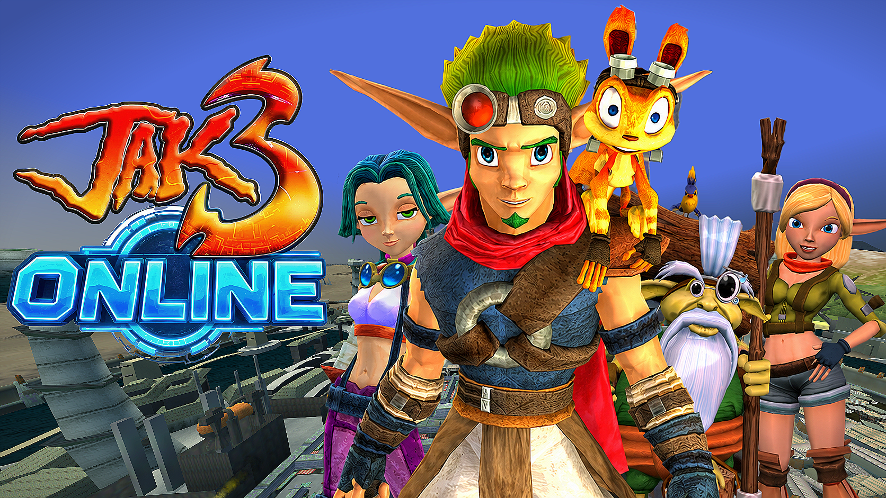

# Jak 3 En Ligne (Jak 3 Online)

Mod multijoueur en ligne pour **Jak 3** sur [OpenGOAL](https://opengoal.dev) : un monde en ligne partagé
(Haven City et le désert), boutique en orbes, véhicules à appeler, boss, courses, téléportation,
personnages jouables (Keira, Jak 2, Jak 1 HD, Jak 4, Tess, Daxter), anti-triche, 23 langues.

- `goal_src/jak3/pc/features/online*.gc` : le code du mod dans le jeu (GOAL)
- `online/src/` : Jak3Online.exe, le programme compagnon (réseau, profil, boutique, anti-triche)
- `online/LISEZ-MOI.txt` : le guide du joueur

Il faut ta propre copie de Jak 3 (PS2) : aucun fichier du jeu n'est dans ce dépôt.

Créé par FUNKI DELIRE (LEON GAGIN).
